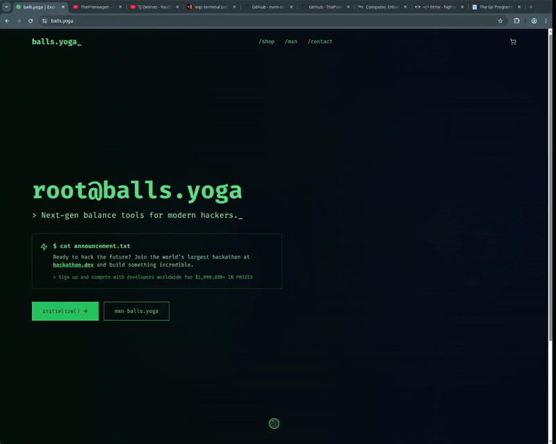
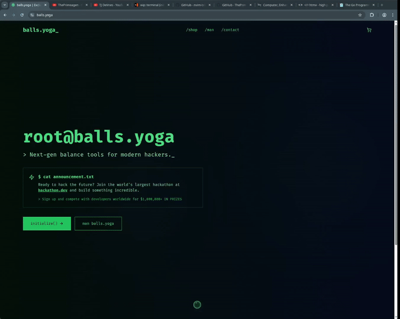
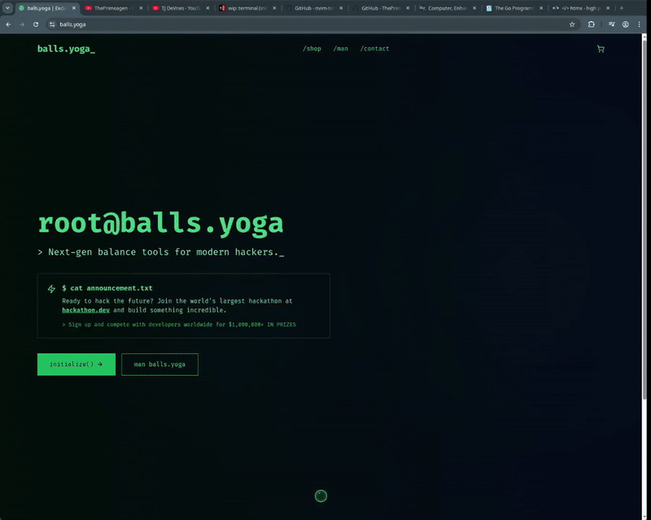

# Telescope.browser 🔭

[](https://opensource.org/licenses/MIT)
[](https://chrome.google.com/webstore) (Pending Approval, coming soon)

A powerful browser extension that provides lightning-fast fuzzy search for tabs with vim-style keyboard navigation. Inspired by Neovim's Telescope and Harpoon plugins.

## ✨ Features

### 🔍 **Fast Tab Navigation with Fuzzy Search**
- **Instant search** across all open tabs by title and URL
- **Keyboard-first interface** with vim-style navigation (`j`/`k` or arrow keys)
- **Smart highlighting** of search matches
- **Recently used sorting** - most recent tabs appear first



### 🎯 **Harpoon System**
- **Bookmark important tabs** for instant access
- **Persistent across sessions** - your harpooned tabs are saved
- **Quick switching** with numbered shortcuts (`space h 1-9`)
- **Visual indicators** show which tabs are harpooned



### 👁️ **Visual Mode** 
- **Vim-style visual selection** for batch operations
- **Multi-tab selection** with `j`/`k` navigation
- **Batch deletion** with `dd` command



## 🚀 Quick Start

### Installation

1. **From Chrome Web Store** (Recommended)
   - Visit the [Chrome Web Store page](#) (Coming Soon)
   - Click "Add to Chrome"

2. **From Source** (Developers)
   ```bash
   git clone https://github.com/dough654/Telescope.Browser.git
   cd telescope-browser
   npm install
   npm run build
   ```
   Then load the `dist/` folder as an unpacked extension in your browser.

### Basic Usage

1. **Open the modal**: Press `Space` two times anywhere on any webpage
2. **Search tabs**: Start typing to filter tabs
3. **Enter Normal Mode**: Press `Escape` to enter normal mode
3. **Navigate**: Use `j`/`k` or arrow keys to select
4. **Switch tabs**: Press `Enter` to switch to selected tab

## ⌨️ Keyboard Shortcuts

### Modal Navigation
- `Space Space` - Open tab search modal
- `Escape` - Close modal (press twice from normal mode)
- `Enter` - Switch to selected tab
- `i` - Enter insert mode (focus search bar)
- `Escape` (in insert) - Return to normal mode

### Tab Navigation
- `j` / `↓` - Move selection down
- `k` / `↑` - Move selection up
- `dd` - Delete/close selected tab (in normal mode)

### Harpoon System
- `Space h` - Show harpoon menu
- `Space h a` - Add current tab to harpoon
- `Space h r` - Remove current tab from harpoon  
- `Space h o` - Open harpoon modal
- `Space 1-9` - Quick switch to harpooned tab

### Visual Mode
- `v` or `V` - Enter visual mode (from normal mode)
- `j`/`k` or arrows - Extend selection
- `dd` - Delete all selected tabs
- `Escape` - Exit visual mode

### Buffer Operations
- `Space l` - Switch to last active tab

## 🛠️ Development

### Prerequisites

- Node.js 18+ 
- Chrome/Chromium or Firefox browser
- Git

### Setup

```bash
# Clone the repository
git clone https://github.com/dough654/Telescope.Browser.git
cd telescope-browser

# Install dependencies
npm install

# Start development build
npm run build:watch

# Run tests
npm test

# Run linting
npm run lint
```

### Available Scripts

- `npm run build` - Build the extension for production
- `npm run build:watch` - Build and watch for changes
- `npm run test:unit` - Run unit tests with Vitest
- `npm run test:e2e` - Run end-to-end tests with Cypress
- `npm run lint` - Run ESLint
- `npm run check` - Run TypeScript/Svelte type checking

### Project Structure

```
telescope-browser/
├── src/
│   ├── components/           # Svelte UI components
│   ├── content-scripts/      # Content script entry point
│   ├── service-workers/      # Background service worker
│   │   ├── managers/         # Feature-specific managers
│   │   ├── messaging/        # Message broker system
│   │   └── storage/          # Storage abstraction layer
│   ├── services/             # Core business logic
│   ├── stores/               # Svelte reactive stores
│   ├── types/                # TypeScript type definitions
│   └── utils/                # Utility functions
├── cypress/                  # E2E tests
├── dist/                     # Built extension files
└── manifest.json             # Browser extension manifest
```

### Testing

We maintain comprehensive test coverage:

- **Unit Tests**: Core logic with Vitest
- **E2E Tests**: Full user workflows with Cypress
- **Visual Mode Tests**: Complete coverage of vim-style selection
- **Race Condition Tests**: Concurrent operation safety

```bash
# Run specific test suites
npm run test:unit -- --grep "visual mode"
npm run test:e2e -- --spec "cypress/e2e/visual-mode-*.cy.ts"
```

## 🤝 Contributing

We welcome contributions! Please see our [Contributing Guidelines](CONTRIBUTING.md) for details.

### Quick Contribution Guide

1. Fork the repository
2. Create a feature branch: `git checkout -b feature/amazing-feature`
3. Make your changes and add tests
4. Ensure all tests pass: `npm test`
5. Commit with conventional commits: `git commit -m "feat: add amazing feature"`
6. Push and create a Pull Request

## 📄 Privacy & Permissions

Telescope.browser respects your privacy:

- **Local Processing**: All data stays on your device
- **No Tracking**: No analytics or telemetry
- **Minimal Permissions**: Only requests necessary permissions
- **Open Source**: Full transparency with public source code

### Required Permissions

- `tabs` - Read tab titles and URLs for search
- `storage` - Save harpoon bookmarks and settings
- `scripting` - Inject content script for modal functionality
- `<all_urls>` - Access all sites to inject the search modal

## 🐛 Bug Reports & Feature Requests

- **Bug Reports**: [GitHub Issues](https://github.com/dough654/telescope-browser/issues)
- **Feature Requests**: [GitHub Discussions](https://github.com/dough654/telescope-browser/discussions)
- **Security Issues**: See [SECURITY.md](SECURITY.md)

## 🏆 Acknowledgments

- [Telescope.nvim](https://github.com/nvim-telescope/telescope.nvim) - Inspiration for the modal interface and fuzzy search capabilities
- [Harpoon](https://github.com/ThePrimeagen/harpoon/tree/harpoon2) - Inspiration for quick tab bookmarking and navigation

## 📜 License

This project is licensed under the MIT License - see the [LICENSE](LICENSE) file for details.

---

<p align="center">
  <strong>Made with ❤️ for neovim enthusiasts</strong>
</p>

<p align="center">
  <a href="#-quick-start">Get Started</a> •
  <a href="CONTRIBUTING.md">Contribute</a> •
  <a href="https://github.com/dough654/telescope-browser/issues">Report Bug</a>
</p>
